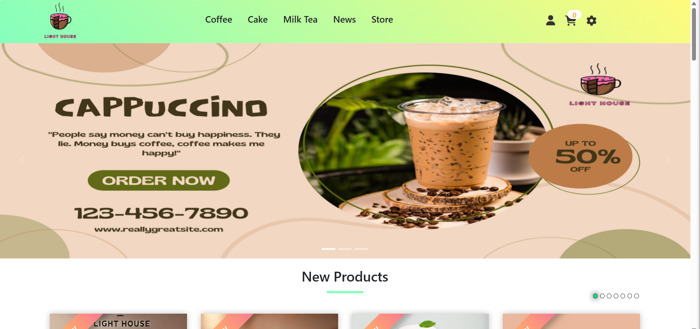

# LightHouseShop ☕

A comprehensive Java web application for an online coffee and beverage shop with user authentication, product management, order processing, and admin dashboard.

## Features

- User authentication and account management
- Product catalog with categories and search functionality
- Shopping cart and checkout process
- Order management system
- Admin dashboard with analytics
- User reviews and ratings
- Payment integration with VNPay
- Social login with Facebook and Google

## Project Structure

- **src/java**: Contains Java source files
  - **controller**: Servlet controllers for handling HTTP requests
    - **admin**: Admin-specific controllers
  - **dal**: Data Access Layer for database operations
  - **model**: Java beans representing business entities
  - **filter**: Contains filters for request processing
- **web**: Contains web resources
  - **WEB-INF**: Web configuration and admin views
  - **assets**: CSS, JavaScript, and image files
  - **.jsp files**: JSP pages for the frontend

## Technologies Used

- **Backend**: Java Servlets, JSP, JSTL
- **Frontend**: HTML5, CSS3, JavaScript
- **Database**: SQL Server (JDBC for connectivity)
- **Authentication**: Custom auth + Social logins (Facebook, Google)
- **Payment**: VNPay integration
- **Others**: Jakarta Mail for email functionality

## Setup Instructions

1. Clone the repository
2. Set up the database using the SQL script in the `database` folder
3. Configure the database connection in `DBContext.java`
4. Deploy the project on a Servlet container (Tomcat, etc.)
5. Access the application via browser

## Screenshots

## License

This project is licensed under the MIT License.
